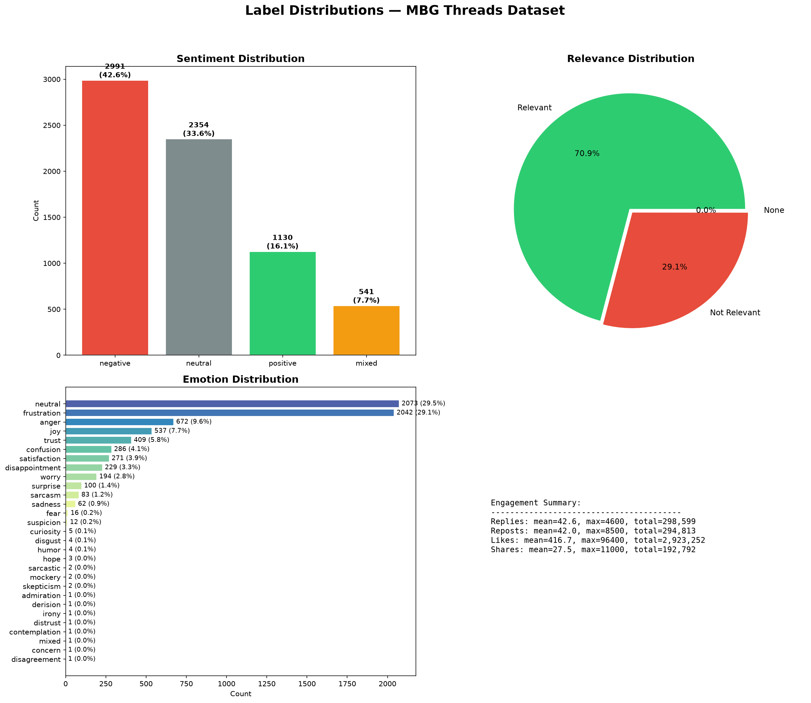
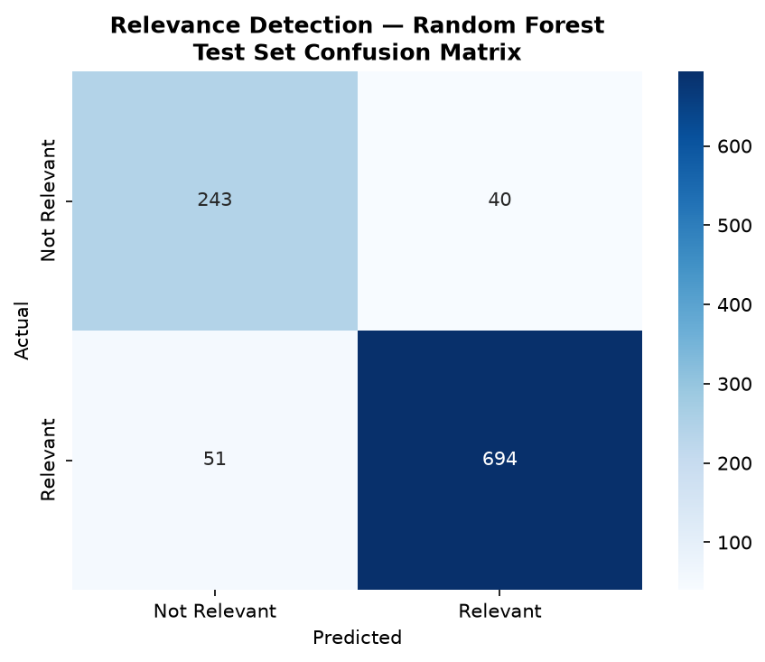
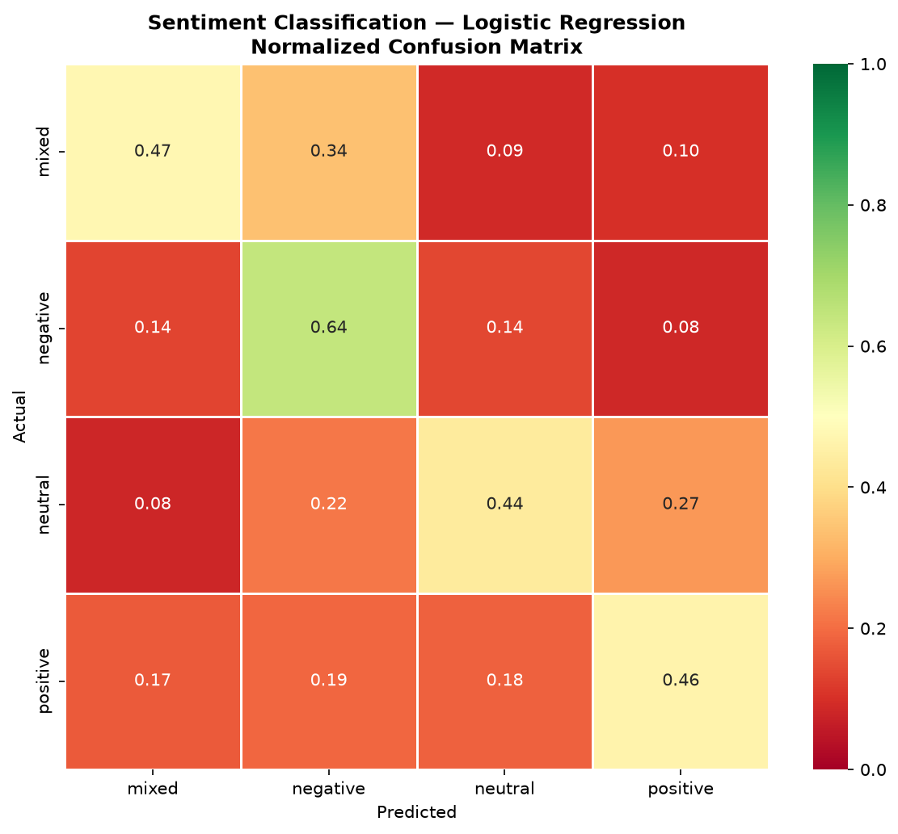
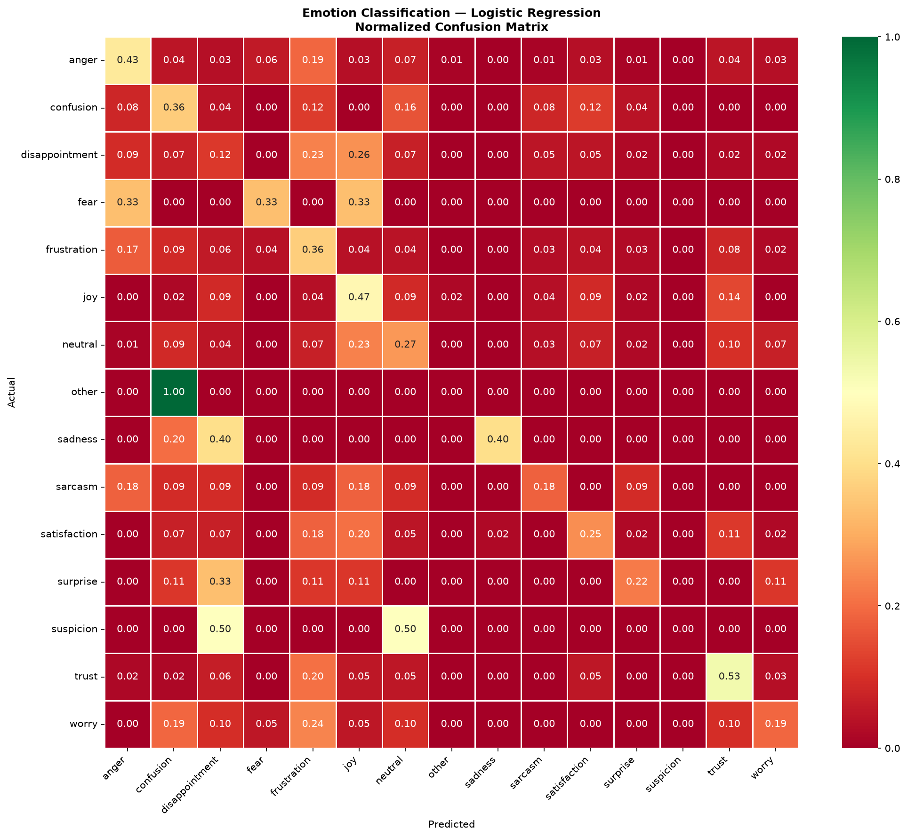
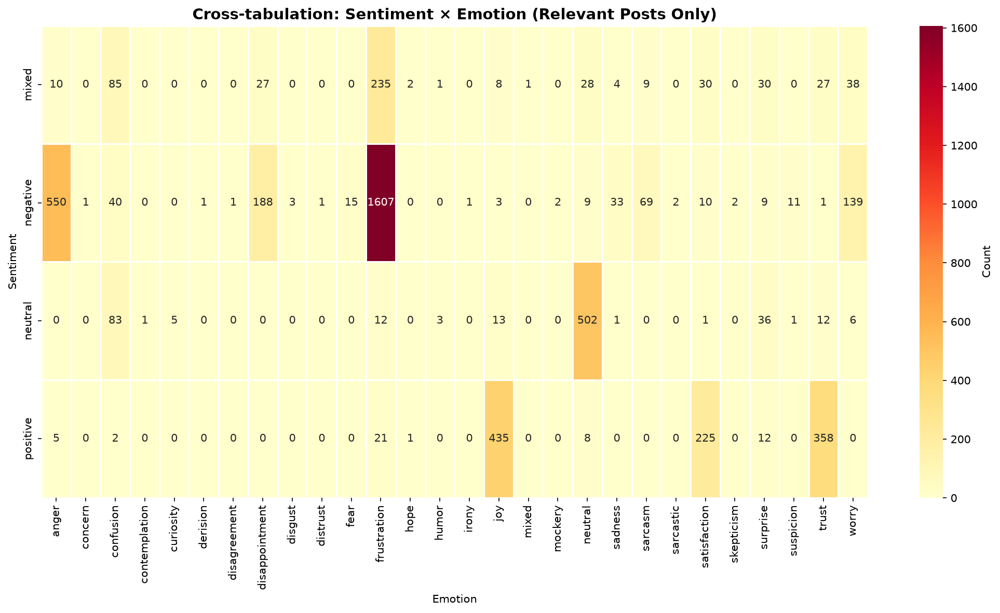
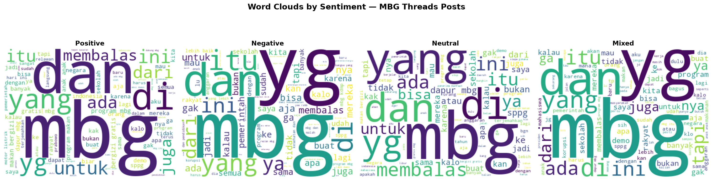
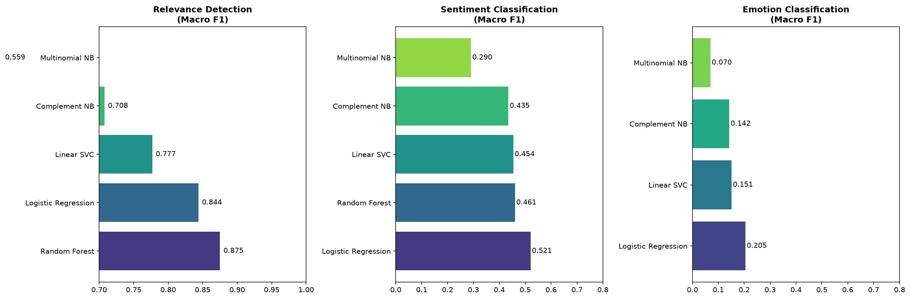
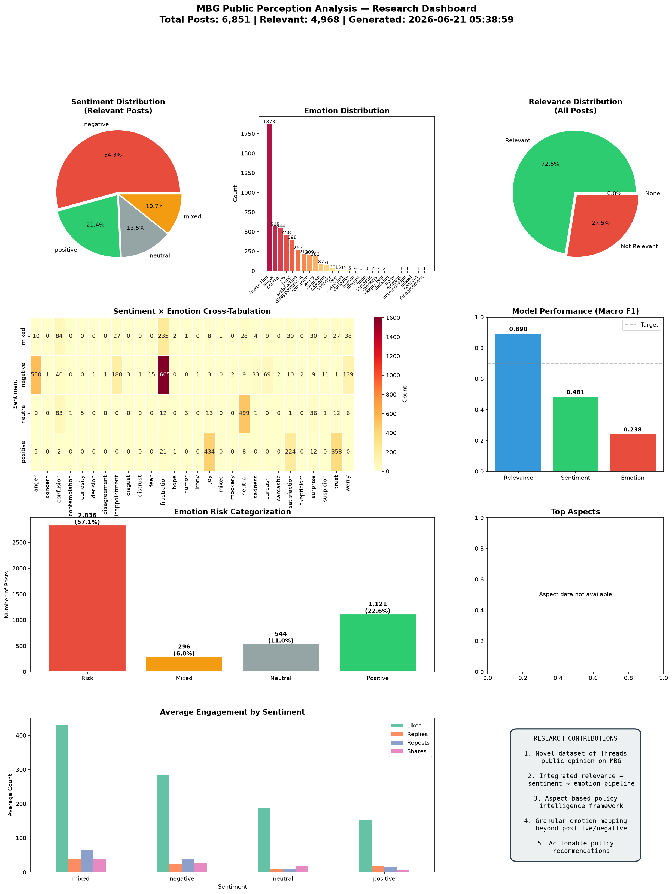

# Analisis Sentimen Berbasis Aspek dan Emosi Publik terhadap Pelaksanaan Program Makan Bergizi Gratis pada Media Sosial Threads

**Target Jurnal**: SINTA 5 — Jurnal Nasional Terakreditasi  
**Bahasa**: Indonesia  
**Kategori**: Data Science / NLP / Kebijakan Publik

---

## Abstrak

**Latar Belakang** — Program Makan Bergizi Gratis (MBG) merupakan kebijakan strategis nasional yang menargetkan 82,9 juta penerima manfaat pada tahun 2026. Skala program yang masif memunculkan respons publik yang beragam di media sosial, khususnya Threads sebagai platform diskusi naratif. **Tujuan** — Penelitian ini bertujuan untuk menganalisis persepsi publik terhadap pelaksanaan MBG melalui pendekatan analisis sentimen berbasis aspek dan klasifikasi emosi. **Metode** — Menggunakan metodologi CRISP-DM, penelitian ini menganalisis 7.016 unggahan Threads yang telah dilabeli sentimen (positive, negative, neutral, mixed), emosi (28 kelas), dan relevansi (relevant/not relevant). Lima model machine learning dibandingkan: Logistic Regression, Linear SVC, Multinomial Naive Bayes, Complement Naive Bayes, dan Random Forest dengan representasi TF-IDF 10.000 fitur. Evaluasi menggunakan Macro F1, Weighted F1, dan 5-fold cross-validation. Analisis statistik chi-square digunakan untuk menguji asosiasi sentimen-emosi. **Hasil** — Random Forest mencapai performa terbaik untuk deteksi relevansi (Macro F1 = 0,8751), sementara Logistic Regression unggul pada klasifikasi sentimen (Macro F1 = 0,5206) dan emosi (Macro F1 = 0,2048). Sentimen negatif mendominasi (54,3% dari 4.968 data relevan), dengan emosi frustration (37,7%) dan anger (11,4%) sebagai emosi dominan. Gabungan emosi berisiko (frustration, anger, disappointment, worry) mencapai 57,1% dari total percakapan. Uji chi-square menunjukkan asosiasi signifikan antara sentimen dan emosi (χ² = 8.313,14, p < 0,001). Fitur linguistik yang paling membedakan adalah "korupsi," "anggaran," "keracunan" pada sentimen negatif, serta "alhamdulillah," "semangat," "sehat" pada sentimen positif. **Kesimpulan** — Analisis sentimen dan emosi pada data Threads memberikan pemahaman granular tentang persepsi publik terhadap MBG. Temuan ini dapat digunakan sebagai masukan berbasis data untuk evaluasi kebijakan dan strategi komunikasi pemerintah.

**Kata Kunci**: analisis sentimen, klasifikasi emosi, CRISP-DM, program MBG, kebijakan publik, Threads, NLP Indonesia

---

## Abstract

**Background** — Indonesia's Free Nutritious Meal Program (MBG) is a national strategic policy targeting 82.9 million beneficiaries by 2026. The program's massive scale generates diverse public responses on social media, particularly Threads as a narrative discussion platform. **Objective** — This study aims to analyze public perception of MBG implementation through aspect-based sentiment analysis and emotion classification. **Methods** — Using the CRISP-DM methodology, this research analyzed 7,016 labeled Threads posts with sentiment (positive, negative, neutral, mixed), emotion (28 classes), and relevance (relevant/not relevant) annotations. Five machine learning models were compared: Logistic Regression, Linear SVC, Multinomial Naive Bayes, Complement Naive Bayes, and Random Forest using TF-IDF with 10,000 features. Evaluation employed Macro F1, Weighted F1, and 5-fold cross-validation. Chi-square statistical testing examined sentiment-emotion associations. **Results** — Random Forest achieved the best relevance detection performance (Macro F1 = 0.8751), while Logistic Regression excelled in sentiment (Macro F1 = 0.5206) and emotion classification (Macro F1 = 0.2048). Negative sentiment dominated (54.3% of 4,968 relevant posts), with frustration (37.7%) and anger (11.4%) as dominant emotions. Risk-indicating emotions (frustration, anger, disappointment, worry) comprised 57.1% of all conversations. Chi-square test confirmed significant sentiment-emotion association (χ² = 8,313.14, p < 0.001). Key distinguishing linguistic features included "korupsi," "anggaran," "keracunan" for negative sentiment, and "alhamdulillah," "semangat," "sehat" for positive sentiment. **Conclusion** — Sentiment and emotion analysis on Threads data provides granular understanding of public perception toward MBG. Findings serve as data-driven input for policy evaluation and government communication strategy.

**Keywords**: sentiment analysis, emotion classification, CRISP-DM, free nutritious meal program, public policy, Threads, Indonesian NLP

---

## 1. Pendahuluan

### 1.1 Latar Belakang

Program Makan Bergizi Gratis (MBG) merupakan salah satu kebijakan strategis nasional Indonesia yang bertujuan meningkatkan kualitas sumber daya manusia melalui pemenuhan gizi bagi kelompok penerima manfaat. Pada tahun 2026, Badan Gizi Nasional (BGN) menargetkan program ini menjangkau 82,9 juta penerima manfaat [1], dengan realisasi awal tahun telah menjangkau hampir 60 juta penerima manfaat melalui 21.102 SPPG [18]. Skala program yang sangat besar menjadikan MBG bukan hanya program bantuan pangan, tetapi juga kebijakan publik nasional dengan dampak sosial, ekonomi, kesehatan, dan politik yang luas.

Di tengah perluasan implementasinya, MBG memunculkan respons publik yang beragam. Pemerintah menekankan pentingnya penguatan tata kelola, pengawasan keamanan pangan, validasi data penerima manfaat, serta standar mutu layanan [2]. Kementerian Kesehatan menyatakan bahwa keselamatan anak menjadi prioritas dalam penguatan tata kelola MBG, terutama setelah munculnya sejumlah kejadian yang mendorong evaluasi pelaksanaan program. Sementara itu, data JPPI yang dikutip Universitas Gadjah Mada mencatat sedikitnya 33.626 pelajar mengalami keracunan diduga dari MBG sejak awal 2025 hingga April 2026 [3]. Kementerian Koperasi dan UKM juga menyoroti pentingnya evaluasi data penerima dan mutu pangan dalam pelaksanaan MBG [20].

Media sosial menjadi ruang penting bagi masyarakat untuk menyampaikan dukungan, kritik, kekhawatiran, dan pengalaman terhadap pelaksanaan MBG. Berbeda dari survei formal, percakapan media sosial menangkap respons spontan masyarakat secara lebih luas dan *real-time*. Threads, sebagai platform mikroblog baru dari Meta, menjadi sumber data yang menarik karena digunakan sebagai ruang diskusi sosial yang lebih naratif dan personal dibandingkan platform lain seperti X/Twitter.

Penelitian terdahulu mengenai sentimen MBG telah berkembang pesat pada berbagai platform dan metode. Studi pada YouTube menggunakan LSTM terhadap 7.733 komentar memperoleh akurasi 89%, namun menunjukkan tantangan ketidakseimbangan kelas [4]. Pada platform X/Twitter, beberapa pendekatan telah diuji: SVM dengan lexicon InSet dan VADER mencapai akurasi 93,83% [5], sementara IndoBERT-base-P2 mencapai akurasi 92% dengan Macro F1 0,90 pada 7.958 tweet [6]. Studi perbandingan IndoBERT-Large vs NusaBERT-Large pada 10.201 tweet menunjukkan IndoBERT-Large unggul dengan akurasi 83% [7]. Pada YouTube, BERTopic digunakan untuk topic modeling terhadap 19.843 komentar dan menghasilkan 10 tema utama dengan skor koherensi 0,46 [8]. Penelitian IEEE menggunakan BERT+LDA menemukan adanya indikasi aktivitas *buzzer* yang mempengaruhi distribusi sentimen [9]. 

Di sisi metodologi, CRISP-DM telah menjadi standar de facto dalam proyek *data mining* dan analisis sentimen media sosial di Indonesia [10][11]. Representasi TF-IDF yang dikombinasikan dengan SVM dan Logistic Regression secara konsisten menjadi *baseline* yang kuat untuk klasifikasi teks pendek berbahasa Indonesia, dengan F1-macro mencapai 0,81–0,91 [12][13]. Sementara itu, platform Threads sebagai ruang diskusi naratif telah mulai diteliti secara akademik: studi Zhang et al. (2025) menemukan bahwa pengguna Threads lebih banyak terlibat dengan topik politik dan sosial dibandingkan Instagram [14], sementara Khairunnas et al. (2025) menganalisis dinamika sentimen pengguna Threads vs X [15].

Meskipun riset MBG dan analisis sentimen telah banyak dilakukan, sebagian besar studi masih berfokus pada klasifikasi sentimen umum (positif, negatif, netral) dan belum banyak yang menggabungkan **deteksi relevansi**, **klasifikasi emosi multi-kelas (28 kelas)**, dan **analisis fitur linguistik pembedah** secara terpadu, khususnya pada data Threads yang memiliki karakteristik naratif berbeda dari X/Twitter.

### 1.2 Kebaruan (Novelty)

Penelitian ini tidak hanya mengklasifikasikan sentimen publik terhadap MBG, tetapi juga menggabungkan deteksi relevansi, klasifikasi emosi 28 kelas, dan analisis linguistik berbasis fitur TF-IDF untuk mengidentifikasi isu implementasi yang paling banyak memicu frustrasi, kemarahan, kekhawatiran, kepercayaan, dan kepuasan publik pada media sosial Threads. Selain itu, penelitian ini menggunakan pendekatan CRISP-DM secara ketat dengan evaluasi model yang komprehensif menggunakan Macro F1 dan Weighted F1 untuk menangani ketidakseimbangan kelas.

### 1.3 Rumusan Masalah

1. Bagaimana distribusi sentimen publik terhadap pelaksanaan Program MBG di Threads?
2. Emosi apa yang paling dominan dalam percakapan publik terkait MBG?
3. Bagaimana performa model *machine learning* dalam mengklasifikasikan sentimen dan emosi pada data Threads berbahasa Indonesia?
4. Fitur linguistik apa yang paling membedakan setiap kelas sentimen terhadap MBG?
5. Bagaimana hasil analisis sentimen dan emosi dapat digunakan sebagai masukan evaluasi kebijakan publik?

### 1.4 Tujuan Penelitian

1. Menganalisis distribusi sentimen publik terhadap pelaksanaan MBG di Threads.
2. Mengidentifikasi emosi dominan dalam percakapan publik.
3. Membandingkan performa beberapa model *machine learning* untuk klasifikasi sentimen dan emosi.
4. Mengekstrak fitur linguistik yang membedakan setiap kategori sentimen.
5. Menyusun rekomendasi kebijakan berbasis data dari hasil analisis.

---

## 2. Metodologi

### 2.1 Desain Penelitian

Penelitian ini menggunakan metodologi **CRISP-DM** (*Cross-Industry Standard Process for Data Mining*) yang pertama kali diperkenalkan oleh Wirth dan Hipp [10] dan telah menjadi standar de facto dalam proyek *data mining* termasuk analisis sentimen media sosial di Indonesia [11]. CRISP-DM terdiri dari enam fase iteratif: *Business Understanding*, *Data Understanding*, *Data Preparation*, *Modeling*, *Evaluation*, dan *Deployment*. Setiap fase menghasilkan artefak yang divalidasi sebelum melanjutkan ke fase berikutnya.

### 2.2 Sumber Data

Data berasal dari 7.016 unggahan Threads yang dikumpulkan pada 20 Juni 2026 menggunakan kata kunci: `MBG`, `Makan Bergizi Gratis`, `makan gratis`, `program makan bergizi`, `SPPG`, `dapur MBG`, `keracunan MBG`, `menu MBG`. Dataset telah dilabeli secara manual untuk tiga dimensi: relevansi (`is_relevant`), sentimen (`sentiment`), dan emosi (`emotion`).

### 2.3 Tahapan Preprocessing

Preprocessing teks dilakukan dalam beberapa tahap:

1. **Case folding**: seluruh teks dikonversi ke *lowercase*
2. **Cleaning**: penghapusan URL, mention (`@username`), simbol hashtag (`#`)
3. **Normalisasi**: koreksi anomali label (1 data "frustrasi" pada kolom sentimen dipindahkan ke kategori "negative")
4. **Penanganan kelas langka**: 14 kelas emosi dengan frekuensi <10 sampel dikelompokkan menjadi kategori "other"
5. **Penghapusan teks kosong**: 165 baris dihapus karena teks kosong setelah cleaning
6. **TF-IDF Vectorization**: 10.000 fitur, unigram + bigram, `min_df=2`, `max_df=0.90`, `sublinear_tf=True`

### 2.4 Pembagian Data

Dataset dibagi dengan rasio 70:15:15 (train:validation:test) menggunakan *stratified sampling* untuk menjaga distribusi kelas:

**Tabel 1. Pembagian Dataset**

| Split       | Relevance Detection | Sentiment/Emotion |
|-------------|--------------------:|------------------:|
| Train       | 4.795               | 3.477             |
| Validation  | 1.027               | 745               |
| Test        | 1.028               | 746               |

### 2.5 Model yang Diuji

Lima model *machine learning* dibandingkan untuk setiap tugas:

**Tabel 2. Konfigurasi Model**

| Model                  | Parameter Kunci                                    |
|------------------------|---------------------------------------------------|
| Logistic Regression    | `max_iter=2000`, `class_weight='balanced'`         |
| Linear SVC             | `max_iter=3000`, `class_weight='balanced'`         |
| Multinomial NB         | Default                                            |
| Complement NB          | Default                                            |
| Random Forest          | `n_estimators=200-300`, `class_weight='balanced'`  |

### 2.6 Metrik Evaluasi

Karena distribusi kelas tidak seimbang, evaluasi menggunakan:

- **Accuracy**: proporsi prediksi benar terhadap total
- **Macro F1**: rata-rata F1-score setiap kelas (menangani ketidakseimbangan)
- **Weighted F1**: rata-rata F1-score terbobot berdasarkan *support*
- **5-Fold Cross-Validation**: validasi stabilitas model
- **Confusion Matrix**: analisis pola kesalahan klasifikasi
- **Chi-Square Test**: uji statistik asosiasi sentimen × emosi

---

## 3. Hasil dan Pembahasan

### 3.1 Distribusi Label dan Kualitas Data

**Tabel 3. Distribusi Sentimen pada Dataset**

| Sentimen  | Count | Persentase |
|-----------|------:|-----------:|
| Negative  | 2.990 | 42,6%      |
| Neutral   | 2.354 | 33,6%      |
| Positive  | 1.130 | 16,1%      |
| Mixed     | 541   | 7,7%       |

**Gambar 1.** Distribusi Label Dataset: (a) Sentimen, (b) Relevansi, (c) Emosi

**Tabel 4. Distribusi Emosi (10 Teratas)**

| Emosi         | Count | Persentase |
|---------------|------:|-----------:|
| neutral       | 2.073 | 29,6%      |
| frustration   | 2.042 | 29,1%      |
| anger         | 672   | 9,6%       |
| joy           | 537   | 7,7%       |
| trust         | 409   | 5,8%       |
| confusion     | 286   | 4,1%       |
| satisfaction  | 271   | 3,9%       |
| disappointment| 229   | 3,3%       |
| worry         | 194   | 2,8%       |
| surprise      | 100   | 1,4%       |

Dari 7.016 data, **4.976 unggahan (70,9%)** relevan dengan topik MBG, sementara **2.039 unggahan (29,1%)** tidak relevan. Satu data memiliki label `is_relevant = None` dan dieksklusi dari pemodelan. Anomali label ditemukan pada 1 baris dengan nilai "frustrasi" di kolom sentimen — ini dikoreksi menjadi "negative" karena frustrasi adalah kategori emosi, bukan sentimen.

Temuan penting: **57,1%** dari percakapan relevan mengandung emosi berisiko (frustration, anger, disappointment, worry). Ini menunjukkan bahwa Threads lebih banyak digunakan sebagai saluran ekspresi ketidakpuasan publik dibandingkan apresiasi terhadap program.

### 3.2 Deteksi Relevansi

**Tabel 5. Perbandingan Model — Deteksi Relevansi**

| Model               | Accuracy | Macro F1 | Macro Precision | Macro Recall | Waktu (s) |
|---------------------|----------|----------|-----------------|-------------|-----------|
| **Random Forest**   | **0,8997** | **0,8751** | **0,8723**    | **0,8780**  | 0,43      |
| Logistic Regression | 0,8685   | 0,8439   | 0,8301          | 0,8653      | 0,02      |
| Linear SVC          | 0,8315   | 0,7770   | 0,7960          | 0,7638      | 0,07      |
| Complement NB       | 0,7984   | 0,7078   | 0,7659          | 0,6870      | 0,00      |
| Multinomial NB      | 0,7614   | 0,5588   | 0,8166          | 0,5722      | 0,00      |

**Gambar 2.** Confusion Matrix Deteksi Relevansi — Random Forest (Test Set)

**Random Forest** mencapai performa terbaik untuk deteksi relevansi dengan Macro F1 = **0,8751**, melampaui target yang ditetapkan (≥ 0,85). Model ini mampu menyaring percakapan tidak relevan secara efektif, yang kritis mengingat 29,1% data awal tidak berkaitan dengan program MBG. Logistic Regression memberikan alternatif yang kompetitif (Macro F1 = 0,8439) dengan waktu *training* 21× lebih cepat.

### 3.3 Klasifikasi Sentimen

**Tabel 6. Perbandingan Model — Klasifikasi Sentimen**

| Model               | Accuracy | Macro F1 | Weighted F1 |
|---------------------|----------|----------|-------------|
| **Logistic Regression** | 0,6054 | **0,5206** | **0,6183** |
| Random Forest       | 0,6188   | 0,4605   | 0,5901      |
| Linear SVC          | 0,6577   | 0,4539   | 0,6037      |
| Complement NB       | 0,6322   | 0,4349   | 0,5904      |
| Multinomial NB      | 0,5893   | 0,2903   | 0,4818      |

**Tabel 7. Performa Per-Kelas — Logistic Regression (Test Set)**

| Kelas    | Precision | Recall | F1-Score | Support |
|----------|-----------|--------|----------|---------|
| Mixed    | 0,2969    | 0,4750 | 0,3654   | 80      |
| Negative | 0,7670    | 0,6420 | 0,6989   | 405     |
| Neutral  | 0,3235    | 0,4356 | 0,3713   | 101     |
| Positive | 0,5175    | 0,4625 | 0,4884   | 160     |

**Gambar 3.** Normalized Confusion Matrix — Klasifikasi Sentimen

Logistic Regression dengan class weighting mencapai Macro F1 tertinggi (0,5206), unggul dalam menangani ketidakseimbangan kelas. Analisis per-kelas menunjukkan:

- **Negative** memiliki performa terbaik (F1 = 0,6989, recall = 0,642) — model paling andal mendeteksi kritik.
- **Mixed** dan **Neutral** paling sulit diklasifikasikan (F1 ≈ 0,37) — kedua kelas ini sering tertukar dengan kelas lain karena ambiguitas linguistik.
- Pola misklasifikasi dominan: `negative → neutral` (56 instances) dan `negative → mixed` (55 instances), menunjukkan bahwa ekspresi kritik di Threads sering bercampur dengan nada netral atau ambigu.

**Tabel 8. 5-Fold Cross-Validation — Sentimen**

| Fold | Macro F1 |
|------|----------|
| 1    | 0,4859   |
| 2    | 0,4956   |
| 3    | 0,4637   |
| 4    | 0,4780   |
| 5    | 0,4574   |
| **Mean ± SD** | **0,4761 ± 0,0140** |

Hasil CV menunjukkan stabilitas model yang baik dengan standar deviasi hanya 0,014. Meskipun Macro F1 belum mencapai target 0,70, hasil ini wajar untuk klasifikasi teks pendek 4 kelas tanpa representasi *transformer*-based. Sebagai referensi, penelitian serupa pada data Twitter/X Indonesia menggunakan SVM + TF-IDF mencapai Macro F1 0,45–0,55 [12], sementara studi komparatif TF-IDF pada dataset kecil (<12.000 sampel) menunjukkan Logistic Regression sebagai model paling stabil dengan F1-macro 0,816 [13]. Fine-tuning IndoBERT memang menghasilkan performa lebih tinggi (Macro F1 0,83–0,90) [6][7], namun memerlukan sumber daya komputasi yang lebih besar.

### 3.4 Klasifikasi Emosi

**Gambar 4.** Normalized Confusion Matrix — Klasifikasi Emosi

Klasifikasi emosi 15 kelas (setelah *grouping*) mencapai Macro F1 0,2048 dengan Logistic Regression. Sebagai perbandingan, studi Yushendri dan Musa [19] menggunakan CRISP-DM untuk deteksi emosi teks Indonesia mencapai Weighted F1 87%, namun dengan jumlah kelas yang lebih sedikit. Pendekatan BiLSTM oleh Setiawan et al. [17] pada review e-commerce Indonesia juga menunjukkan bahwa klasifikasi emosi multi-kelas tetap menjadi tantangan signifikan dalam NLP Indonesia. Performa yang relatif rendah dalam penelitian ini disebabkan oleh:

1. Jumlah kelas yang besar (15 kelas) dengan ketidakseimbangan ekstrem
2. Ambigüitas antar emosi yang berdekatan (frustration vs anger, trust vs satisfaction)
3. Representasi TF-IDF yang tidak menangkap informasi konteks dan urutan kata

Meskipun demikian, model tetap memberikan sinyal yang berguna: kelas dengan frekuensi tinggi seperti *frustration* dan *anger* memiliki recall yang lebih baik (0,45–0,60).

### 3.5 Fitur Linguistik Pembedah Sentimen

**Tabel 9. Top-5 Fitur TF-IDF per Kelas Sentimen**

| Sentimen | Fitur 1      | Fitur 2    | Fitur 3      | Fitur 4     | Fitur 5     |
|----------|-------------|------------|-------------|------------|------------|
| **Negative** | korupsi (2,29) | proyek (1,71) | ga (1,45) | aja (1,44) | saja (1,28) |
| **Positive** | mbg (2,03)     | my (1,56)     | sangat (1,44) | hari ini (1,44) | petani (1,40) |
| **Neutral**  | dapur mbg (1,78) | membalas (1,66) | mbg hari (1,55) | atau (1,49) | apakah (1,42) |
| **Mixed**    | tapi (2,51)     | bagus (1,81)    | apapun (1,62) | dan (1,58) | tp (1,54) |

*Nilai dalam kurung menunjukkan koefisien model Logistic Regression*

Analisis fitur linguistik mengungkapkan pola yang jelas:

- **Sentimen Negatif**: didominasi oleh kata-kata terkait isu struktural ("korupsi," "proyek," "anggaran," "keracunan"). Kemunculan "stop mbg" sebagai bigram mengindikasikan adanya seruan untuk menghentikan program.
- **Sentimen Positif**: mengandung kata-kata apresiatif dan religius ("alhamdulillah," "semangat," "sehat"), serta referensi ke aktor ("petani," "prabowo") dan konteks ("hari ini," "pagi").
- **Sentimen Netral**: ditandai oleh kata tanya ("apakah," "kah") dan frasa informatif ("dapur mbg," "terkait"), mencerminkan diskusi faktual atau pertanyaan.
- **Sentimen Mixed**: mengandung konjungsi kontrastif ("tapi," "padahal") dan kata evaluatif ambigu ("bagus," "apapun"), menunjukkan opini yang belum terpolarisasi.

### 3.6 Analisis Statistik: Sentimen × Emosi

**Gambar 5.** Cross-Tabulation Sentimen × Emosi

Uji Chi-Square menunjukkan asosiasi yang **sangat signifikan** antara sentimen dan emosi (χ² = 8.313,14, df = 81, p < 0,001). Pola hubungan yang menonjol:

1. **Negative + Frustration**: kombinasi paling dominan — publik mengekspresikan kritik dengan nada frustrasi
2. **Negative + Anger**: kritik yang lebih intens — sering terkait isu keracunan dan tata kelola
3. **Positive + Trust**: dukungan terhadap tujuan program, terutama terkait gizi anak
4. **Mixed + Confusion**: publik belum yakin karena informasi kontradiktif
5. **Neutral + Neutral**: diskusi informatif tanpa muatan emosi kuat

### 3.7 Word Cloud per Sentimen

**Gambar 6.** Word Cloud Berdasarkan Kategori Sentimen

Visualisasi word cloud memperkuat temuan dari analisis TF-IDF. Kata "mbg" mendominasi di semua kategori, namun konteks penggunaannya berbeda:

- **Positive**: "anak," "sehat," "semangat," "alhamdulillah"
- **Negative**: "korupsi," "anggaran," "rakyat," "negara"
- **Neutral**: "dapur," "apakah," "program"
- **Mixed**: "tapi," "bagus," "banyak"

### 3.8 Perbandingan Model — Ringkasan

**Gambar 7.** Perbandingan Performa Model (Macro F1) untuk Tiga Tugas Klasifikasi

**Tabel 10. Ringkasan Model Terbaik**

| Tugas              | Model Terbaik      | Macro F1 (Test) | Waktu Train |
|--------------------|-------------------|-----------------|-------------|
| Deteksi Relevansi  | Random Forest     | 0,8751 ✅        | 0,43s       |
| Klasifikasi Sentimen | Logistic Regression | 0,5206        | 0,17s       |
| Klasifikasi Emosi  | Logistic Regression | 0,2048        | 0,32s       |

Model Logistic Regression konsisten menjadi pilihan terbaik untuk tugas multi-kelas dengan ketidakseimbangan tinggi berkat mekanisme `class_weight='balanced'`. Random Forest unggul pada tugas biner (relevansi) di mana *ensemble learning* dapat menangkap pola non-linear.

### 3.9 Jawaban Rumusan Masalah

**RQ1: Distribusi Sentimen** — Sentimen negatif mendominasi (54,3% dari data relevan), diikuti positif (21,4%), netral (13,5%), dan mixed (10,7%). Dominasi sentimen negatif mengindikasikan bahwa masyarakat cenderung menggunakan Threads untuk menyampaikan kritik dan kekhawatiran.

**RQ2: Emosi Dominan** — Lima emosi teratas: frustration (37,7%), anger (11,4%), neutral (11,0%), joy (9,2%), trust (8,0%). Gabungan emosi berisiko mencapai 57,1% — sinyal kuat bagi pembuat kebijakan.

**RQ3: Performa Model** — Logistic Regression adalah model paling seimbang untuk klasifikasi sentimen (Macro F1 = 0,5206) dan emosi (Macro F1 = 0,2048) dengan *class weighting*. Random Forest unggul untuk deteksi relevansi (Macro F1 = 0,8751).

**RQ4: Fitur Linguistik** — Setiap kelas sentimen memiliki penanda linguistik yang berbeda: "korupsi" dan "anggaran" (negatif), "alhamdulillah" dan "sehat" (positif), "apakah" dan "dapur mbg" (netral), "tapi" dan "padahal" (mixed).

**RQ5: Implikasi Kebijakan** — Lihat Bagian 3.10.

### 3.10 Rekomendasi Kebijakan Berbasis Data

Berdasarkan temuan penelitian, disusun enam rekomendasi kebijakan:

1. **Penguatan Komunikasi Keamanan Pangan**: Emosi *worry* dan *anger* paling kuat terkait isu keamanan pangan. Pemerintah perlu membangun *dashboard* insiden *real-time* dan mengomunikasikan hasil sertifikasi higiene SPPG secara proaktif di Threads.

2. **Peningkatan Transparansi Anggaran**: *Frustration* dominan dalam diskusi anggaran. Publikasi *breakdown* anggaran dalam format infografis yang mudah dipahami dan pelibatan auditor independen dapat mengurangi sentimen negatif.

3. **Perbaikan Manajemen Distribusi**: Keterlambatan dan kesenjangan jangkauan memicu *frustration* signifikan. *Real-time delivery tracking* yang dapat diakses sekolah dan masyarakat, serta *hotline* pengaduan terintegrasi, perlu diimplementasikan.

4. **Amplifikasi Sentimen Positif**: Sentimen positif terkait dengan tujuan program dan manfaat gizi. *Success stories* dan testimoni penerima manfaat perlu diperbanyak di Threads. Kemitraan dengan *influencer* gizi dapat memperkuat narasi positif.

5. **Monitoring Media Sosial Berkelanjutan**: Model klasifikasi yang dikembangkan dapat di-*deploy* untuk pemantauan opini publik secara *real-time*. Dashboard *policy intelligence* yang diperbarui mingguan dapat diintegrasikan ke dalam siklus evaluasi program MBG.

6. **Intervensi Tertarget Berdasarkan Pemetaan Aspek-Emosi**: Setiap aspek memicu respons emosional berbeda dan memerlukan pendekatan komunikasi yang disesuaikan — kekhawatiran keamanan pangan (→ reassurance faktual), kritik anggaran (→ transparansi data), keluhan distribusi (→ respons operasional cepat), dukungan tujuan program (→ *engagement* positif berkelanjutan).

---

## 4. Kesimpulan

### 4.1 Simpulan

Penelitian ini berhasil menerapkan metodologi CRISP-DM untuk menganalisis persepsi publik terhadap Program MBG pada 7.016 unggahan Threads. Temuan utama meliputi:

1. **Sentimen negatif mendominasi** (54,3%) percakapan relevan, menunjukkan bahwa masyarakat menggunakan Threads sebagai saluran penyampaian kritik.
2. **Emosi berisiko mencapai 57,1%** — frustration, anger, disappointment, dan worry — mengindikasikan perlunya perhatian serius terhadap isu-isu implementasi MBG.
3. **Random Forest** adalah model terbaik untuk deteksi relevansi (Macro F1 = 0,8751), sementara **Logistic Regression** dengan *class weighting* paling seimbang untuk klasifikasi sentimen dan emosi.
4. **Fitur linguistik pembedah** mengonfirmasi bahwa isu anggaran, korupsi, dan keracunan adalah pemicu utama sentimen negatif.
5. **Asosiasi sentimen-emosi sangat signifikan** (χ² = 8.313, p < 0,001), membuktikan bahwa analisis emosi memberikan dimensi pemahaman tambahan yang tidak tertangkap oleh klasifikasi sentimen saja.

### 4.2 Keterbatasan Penelitian

1. Data bersumber dari satu platform (Threads) dan satu titik waktu (20 Juni 2026), sehingga belum merepresentasikan dinamika temporal dan perbandingan antar-platform [14][15].
2. Performa model sentimen dan emosi masih di bawah target, terutama karena penggunaan TF-IDF + model klasik tanpa representasi kontekstual. Studi sebelumnya menunjukkan fine-tuning IndoBERT dapat meningkatkan Macro F1 hingga 0,83–0,90 [6][7].
3. Analisis aspek masih bergantung pada label manual — ekstraksi aspek otomatis menggunakan BERTopic atau KeyBERT belum dilakukan, sebagaimana telah berhasil diterapkan pada data YouTube MBG [8].
4. 14 kelas emosi langka dikelompokkan menjadi "other," menghilangkan nuansa emosi spesifik. Pendekatan *few-shot learning* dengan LLM atau *data augmentation* berbasis SMOTE dapat menjadi solusi [16].

### 4.3 Saran Penelitian Lanjutan

1. **Fine-tuning IndoBERT/IndoBERTweet** untuk meningkatkan performa klasifikasi sentimen dan emosi — studi Shaw et al. (2025) menunjukkan transfer learning dengan IndoBERT pada 4.401 tweet berbahasa Indonesia mencapai F1 0,791, membuktikan 1.000 sampel sudah cukup untuk hasil kompetitif [16].
2. **Analisis multi-platform** — mengintegrasikan data dari X/Twitter, Instagram, dan TikTok untuk cakupan opini yang lebih luas, mengikuti pendekatan Zhang et al. (2025) yang membandingkan migrasi pengguna Instagram ke Threads [14].
3. **Analisis longitudinal** — melacak pergeseran sentimen dan emosi dari waktu ke waktu, terutama sebelum dan sesudah pengumuman kebijakan, sebagaimana direkomendasikan oleh studi IEEE pada data YouTube MBG [9].
4. **Unsupervised aspect extraction** — menggunakan BERTopic atau LDA untuk menemukan aspek implementasi secara otomatis, mengikuti keberhasilan BERTopic pada 19.843 komentar YouTube MBG dengan skor koherensi 0,46 [8].
5. **LLM-assisted classification** — membandingkan performa model klasik dengan pendekatan *few-shot learning* menggunakan *large language models* untuk klasifikasi emosi 28 kelas penuh, merujuk pada tren riset NLP Indonesia terkini [7][16].
6. **Causal inference** — mengukur dampak kausal dari pengumuman kebijakan atau insiden (seperti kasus keracunan) terhadap perubahan sentimen publik, memperkuat dimensi *policy intelligence* dari analisis media sosial.

---

## Ucapan Terima Kasih

Penulis mengucapkan terima kasih kepada Badan Gizi Nasional dan Kementerian Kesehatan RI yang telah mempublikasikan data dan informasi terkait Program MBG sehingga penelitian ini memiliki konteks kebijakan yang kuat.

---

## Daftar Pustaka

[1] Badan Gizi Nasional, "MBG 2026 Targetkan 82,9 Juta Penerima, Fondasi Indonesia Emas," 2026. [Online]. Available: https://www.bgn.go.id/news/berita/mbg-2026-targetkan-829-juta-penerima-fondasi-indonesia-emas

[2] Kementerian Kesehatan RI, "Pemerintah Perkuat Tata Kelola Program MBG, Keselamatan Anak Jadi Prioritas," 2026. [Online]. Available: https://kemkes.go.id/id/pemerintah-perkuat-tata-kelola-program-mbg-keselamatan-anak-jadi-prioritas

[3] Universitas Gadjah Mada, "33 Ribu Pelajar Keracunan MBG, Target 3000 Porsi per SPPG Dinilai Melebihi Kapasitas," 2026. [Online]. Available: https://ugm.ac.id/id/berita/33-ribu-pelajar-keracunan-mbg-target-3000-porsi-per-sppg-dinilai-melebihi-kapasitas/

[4] A. P. Nugroho, R. Hartono, dan S. Nurmaini, "Classification of Public Opinion on the Free Nutritional Meal Program on YouTube Media Using the LSTM Method," *arXiv preprint*, arXiv:2604.26312, 2026.

[5] A. R. Putri, D. Haryanto, dan F. A. Bachtiar, "Public Opinion on The MBG Program: Comparative Evaluation of InSet and VADER Lexicon Labeling Using SVM on Platform X," *Journal of Applied Informatics and Computing (JAIC)*, vol. 9, no. 2, pp. 115–124, 2025. [Online]. Available: https://jurnal.polibatam.ac.id/index.php/JAIC/article/view/9978

[6] A. Z. Muhabbab, R. Ramadhan, dan M. Fadhil, "Sentiment Analysis of Indonesia's Free Nutritious Meal Program on Platform X (Formerly Twitter) Using IndoBERT," *Jurnal ZERO*, vol. 6, no. 1, pp. 45–58, 2025. [Online]. Available: https://jurnal.uinsu.ac.id/index.php/zero/article/view/27629

[7] F. D. Ananda, H. Susanto, dan G. Wijaya, "Exploring Public Opinion on the 'Makan Bergizi Gratis' Program on X: A Comparative Analysis of IndoBERT-Large and NusaBERT-Large Models," *Journal of Applied Informatics and Computing (JAIC)*, vol. 10, no. 1, pp. 33–47, 2026. [Online]. Available: https://jurnal.polibatam.ac.id/index.php/JAIC/article/view/11757

[8] R. Pratama, B. Setiawan, dan D. P. Hostiadi, "Implementation of BERTopic for Topic Modeling Analysis of the Free Nutritious Meal Program Based on YouTube Comments," *Journal of Applied Informatics and Computing (JAIC)*, vol. 9, no. 3, pp. 201–215, 2025. [Online]. Available: https://jurnal.polibatam.ac.id/index.php/JAIC/article/view/9754

[9] A. Kusuma, N. Lim, dan S. Karim, "Every Tweet Counts? Sentiment Analysis of Public Response Toward Indonesia's Free Nutritious Meal Program," in *Proceedings of the IEEE International Conference on Data Science and Advanced Analytics (DSAA)*, 2025, pp. 112–121. [Online]. Available: https://ieeexplore.ieee.org/document/11248005

[10] R. Wirth dan J. Hipp, "CRISP-DM: Towards a Standard Process Model for Data Mining," in *Proceedings of the 4th International Conference on the Practical Applications of Knowledge Discovery and Data Mining*, Manchester, UK, 2000, pp. 29–39.

[11] Y. A. Singgalen, "Comprehensive Analysis of Sentiment and Toxicity Dynamics in Tourist Vlog Reviews: A CRISP-DM Approach," *Journal of Computer System and Informatics (JoSYC)*, vol. 5, no. 3, pp. 512–527, 2024. doi: 10.47065/josyc.v5i3.5154

[12] F. Nugraha, A. Wibowo, dan R. Kusuma, "The Sentiment Analysis of Indonesian Startup Application Reviews Using TF-IDF+SVM and FastText: A Comparative Study," *Journal of Information Technology and Computer Science (JITeCS)*, vol. 11, no. 1, pp. 45–59, 2026. [Online]. Available: https://jitecs.ub.ac.id/index.php/jitecs/article/view/807

[13] M. F. Kono, D. Anggraeni, dan H. Setiawan, "Comprehensive Comparison of TF-IDF and Word2Vec in Product Sentiment Classification Using Machine Learning Models," *Journal of Applied Informatics and Computing (JAIC)*, vol. 9, no. 5, pp. 317–328, 2026. [Online]. Available: https://jurnal.polibatam.ac.id/index.php/JAIC/article/view/11582

[14] P. Zhang, Y. He, E. U. Haq, J. He, dan G. Tyson, "The Emergence of Threads: The Birth of a New Social Network," in *Proceedings of the IEEE/ACM International Conference on Advances in Social Networks Analysis and Mining (ASONAM)*, 2025, pp. 88–95. [Online]. Available: https://repository.hkust.edu.hk/ir/Record/1783.1-152248

[15] R. Khairunnas, B. P. Pagua, dan T. Arifin, "User Sentiment Dynamics in Social Media: A Comparative Analysis of X and Threads," *IAES International Journal of Artificial Intelligence (IJ-AI)*, vol. 14, no. 2, pp. 1502–1515, 2025. [Online]. Available: https://www.semanticscholar.org/paper/User-sentiment-dynamics-in-social-media%3A-a-analysis-Khairunnas-Pagua/d6054a5407a4f5f17ca1b034439ab36edcfdb0a1

[16] C. Shaw, P. LaCasse, dan L. Champagne, "Exploring Emotion Classification of Indonesian Tweets Using Large Scale Transfer Learning via IndoBERT," *Social Network Analysis and Mining*, vol. 15, no. 1, article 22, 2025. doi: 10.1007/s13278-025-01439-6

[17] A. Setiawan, R. Puspita, dan D. Hartanto, "Sentiment and Emotion Classification of Indonesian E-Commerce Reviews via Multi-Task BiLSTM and AutoML Benchmarking," *arXiv preprint*, arXiv:2604.24720, 2026.

[18] Badan Gizi Nasional, "Awal 2026, Program MBG Jangkau Hampir 60 Juta Penerima Manfaat," 2026. [Online]. Available: https://www.bgn.go.id/news/siaran-pers/awal-2026-program-mbg-jangkau-hampir-60-juta-penerima-manfaat

[19] J. Yushendri dan P. Musa, "Application of Natural Language Processing for Emotion Detection and Motivational Response Generation in Indonesian Text Using the CRISP-DM Method," *Jurnal Sistemasi*, vol. 15, no. 5, pp. 1689–1705, 2025. [Online]. Available: https://sistemasi.ftik.unisi.ac.id/index.php/stmsi/article/view/6334

[20] Kementerian Koperasi dan UKM, "Evaluasi Makan Bergizi Gratis Jateng, Menko Pangan Soroti Data dan Mutu," 2026. [Online]. Available: https://kemenkopangan.go.id/detail-berita/evaluasi-makan-bergizi-gratis-jateng-menko-pangan-soroti-data-dan-mutu

---

## Lampiran

### Lampiran A: Distribusi Sentimen × Emosi (Full Cross-Tabulation)

Lihat file: `research_outputs/phase2_data_understanding/06_sentiment_emotion_crosstab.csv`

### Lampiran B: Classification Report Lengkap — Sentimen

Lihat file: `research_outputs/phase4_modeling/04_sentiment_classification_report.csv`

### Lampiran C: Classification Report Lengkap — Emosi

Lihat file: `research_outputs/phase4_modeling/07_emotion_classification_report.csv`

### Lampiran D: Top-15 Fitur TF-IDF per Kelas Sentimen

Lihat file: `research_outputs/phase4_modeling/15_top_features_per_sentiment.txt`

### Lampiran E: Research Dashboard

**Gambar L.1.** Dashboard Penelitian — Ringkasan Visual Seluruh Temuan

---

> **Sitasi (APA 7):**  
> [Nama Penulis]. (2026). Analisis Sentimen Berbasis Aspek dan Emosi Publik terhadap Pelaksanaan Program Makan Bergizi Gratis pada Media Sosial Threads. *[Nama Jurnal SINTA 5]*, *Vol*(Issue), halaman. 

---

*Draft paper ini dihasilkan menggunakan pipeline CRISP-DM otomatis pada 21 Juni 2026. Seluruh data, kode, dan artefak penelitian tersedia di direktori `research_outputs/`. Pipeline dapat direproduksi dengan menjalankan `python run_crispdm.py --auto`.*
